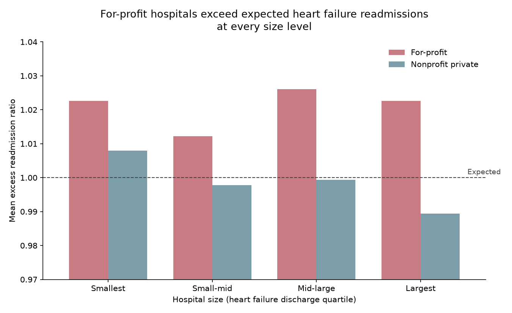

# Hospital Readmissions by Ownership Type

CMS penalizes hospitals that readmit more patients than expected. This looks at
whether for-profit and nonprofit hospitals differ, using FY 2026 data.

## What the number means

The excess readmission ratio compares a hospital's actual readmissions to what
CMS predicts given its patient mix. Above 1.0 is more readmissions than
expected. Below 1.0 is fewer. It centers on 1.0 by construction.

## Result

For-profit hospitals average 1.0151 for heart failure. Nonprofit private
hospitals average 0.9962.

| Ownership | Hospitals | Mean ratio | % above expected |
|---|---:|---:|---:|
| Proprietary (for-profit) | 476 | 1.0151 | 58.2% |
| Government - Hospital District | 182 | 1.0086 | 53.8% |
| Government - Local | 123 | 1.0085 | 58.5% |
| Voluntary nonprofit - Other | 230 | 1.0013 | 47.8% |
| Voluntary nonprofit - Private | 1,348 | 0.9962 | 45.5% |
| Voluntary nonprofit - Church | 195 | 0.9916 | 39.5% |

Federal, State, Tribal, and Physician-owned categories each have under 40
hospitals and are left out of the comparison.

## Checking whether it's really about size

Smaller hospitals do worse:

| Size quartile | Hospitals | Mean ratio | % above expected |
|---|---:|---:|---:|
| Smallest | 579 | 1.0144 | 61.3% |
| Small-mid | 579 | 1.0036 | 51.0% |
| Mid-large | 579 | 1.0033 | 49.6% |
| Largest | 574 | 0.9940 | 43.2% |

For-profits are also smaller. Median heart failure discharges: 192 for
for-profits, 333 for nonprofits. So the ownership difference might just be a
size difference.

Splitting by size shows it isn't:

| Size quartile | For-profit | Nonprofit | Gap |
|---|---:|---:|---:|
| Smallest | 1.0227 (n=149) | 1.0080 (n=231) | +0.0147 |
| Small-mid | 1.0122 (n=126) | 0.9978 (n=288) | +0.0144 |
| Mid-large | 1.0260 (n=84) | 0.9994 (n=328) | +0.0266 |
| Largest | 1.0226 (n=47) | 0.9894 (n=377) | +0.0332 |

For-profit is higher in all four bands, and the gap gets wider at larger sizes,
not smaller.



Nonprofit ratios drop as hospitals get bigger, from 1.0080 down to 0.9894.
For-profit ratios don't move much, 1.0227 to 1.0226.

## Across all six conditions

| Condition | For-profit | Nonprofit | Gap |
|---|---:|---:|---:|
| Coronary artery bypass | 1.0350 | 0.9943 | +0.041 |
| Hip/knee replacement | 1.0299 | 1.0034 | +0.027 |
| Heart attack | 1.0174 | 0.9978 | +0.020 |
| Heart failure | 1.0151 | 0.9962 | +0.019 |
| Pneumonia | 1.0165 | 0.9994 | +0.017 |
| COPD | 1.0054 | 1.0015 | +0.004 |

Higher for for-profits on all six. COPD is close to even.

## Limitations

Ownership is associated with the difference, but this analysis can't say it
causes it. Unmeasured factors could explain both, like the health of the
surrounding population or whether patients can get follow-up care after
discharge.

The 95% confidence intervals for the two groups don't overlap (for-profit 1.0097 to 1.0205, nonprofit 0.9926 to 0.9997), so the difference isn't likely to be sampling noise. That rules out chance, not confounding. The stratified comparison above only holds size constant; other differences between the two groups remain unmeasured.
The largest-quartile for-profit cell has 47 hospitals. It's the smallest group
in the table and carries the biggest gap, so it's the least reliable comparison.

Missing data isn't even across conditions. CMS suppresses ratios when volume is
too low, which affects 71% of hospitals for coronary bypass and 11% for
pneumonia. The six conditions aren't drawing on the same set of hospitals.

This is one year of data.

## Data

From [CMS Provider Data](https://data.cms.gov/provider-data/topics/hospitals):

- FY 2026 Hospital Readmissions Reduction Program, 18,330 rows (one per
  hospital per condition)
- Hospital General Information, 5,432 hospitals

Joined on Facility ID. The readmissions file drops leading zeros from the ID, so
both were padded to six characters before merging. Five hospitals had no match
and were dropped.

## Running it

```bash
python3.12 -m venv venv
source venv/bin/activate
pip install pandas matplotlib

python3 explore.py
python3 analyze.py
python3 chart.py
```

## Stack

Python, pandas, matplotlib
